# Lab2Web
## Nama : Prananda Aditya
## NIM  : 312010130
## Kelas : TI.20.A1
## Mata Kuliah : Pemograman Web

# langkah-langkah Praktikum
 yang pertama adalah membuka text editor, saya disini menggunakan text editor VSCode.
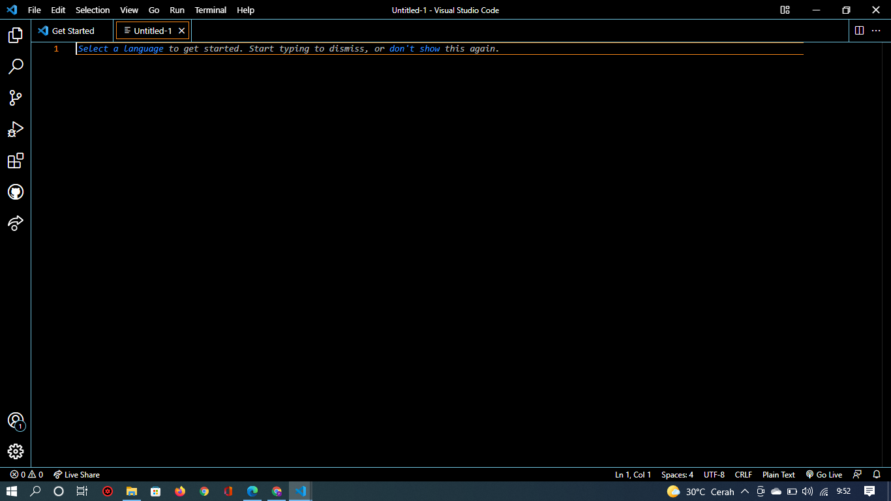

# 1. Membuka Dokumen HTML
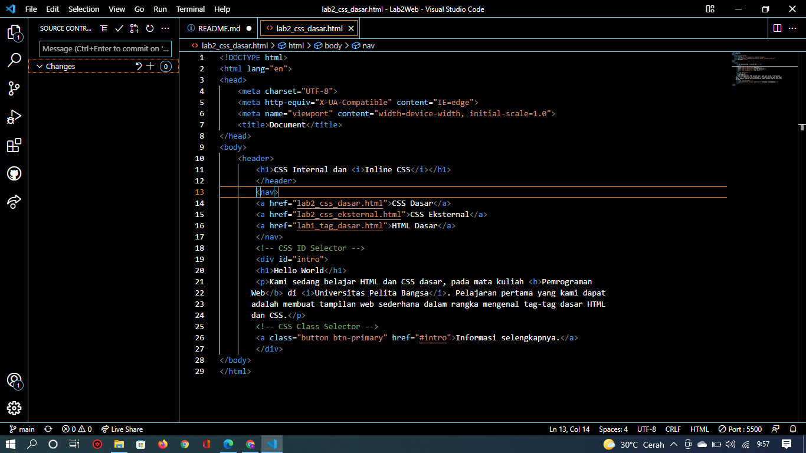
 Selanjutnya buka browser untuk melihat hasilnya
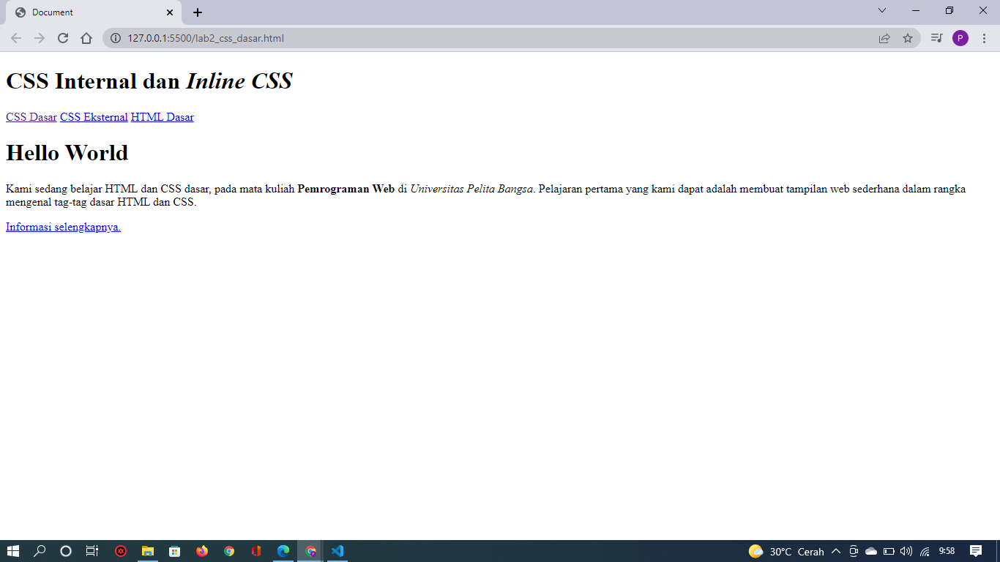

# 2. Mendeklarasikan CSS Internal
 Kemudian tambahkan deklarasi CSS internal seperti berikut pada bagian head dokumen. Seperti gambar dibawah ini :
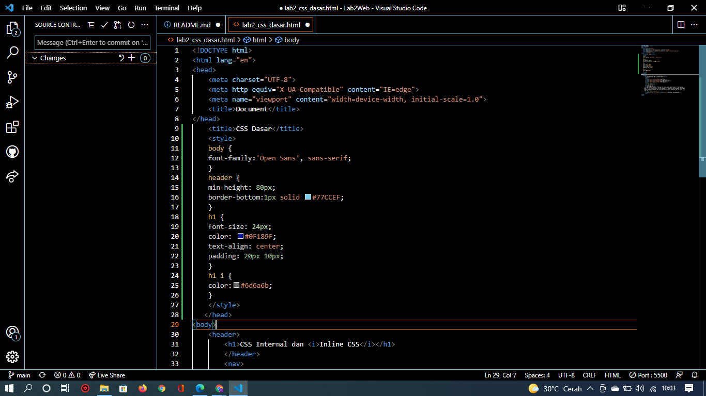
 Selanjutnya buka browser kembali untuk melihat hasilnya.
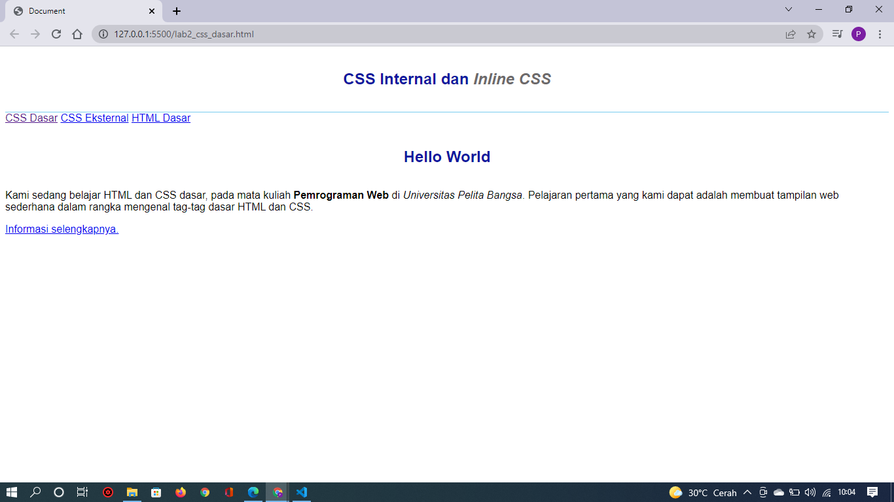

# 3. Menambahkan Inline CSS
 Kemudian tambahkan deklarasi inline CSS pada tag 
 seperti gambar dibawah ini :
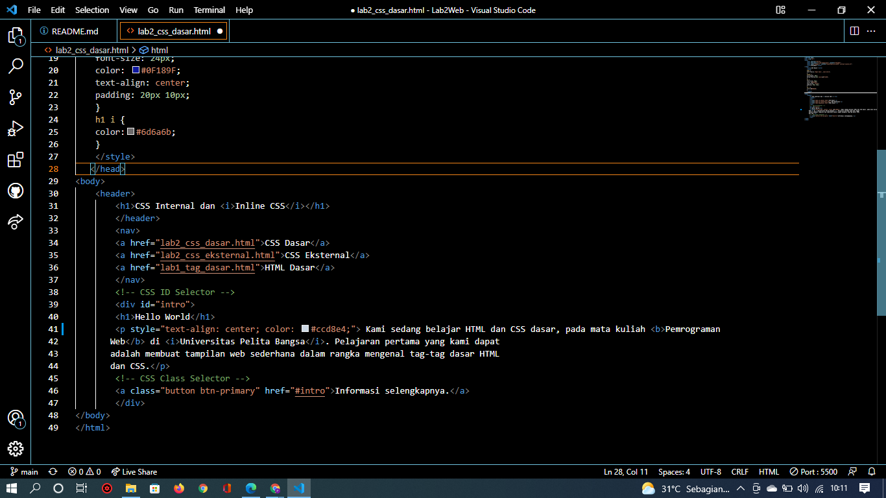
 Simpan kembali dan refresh kembali browser untuk melihat perubahannya.
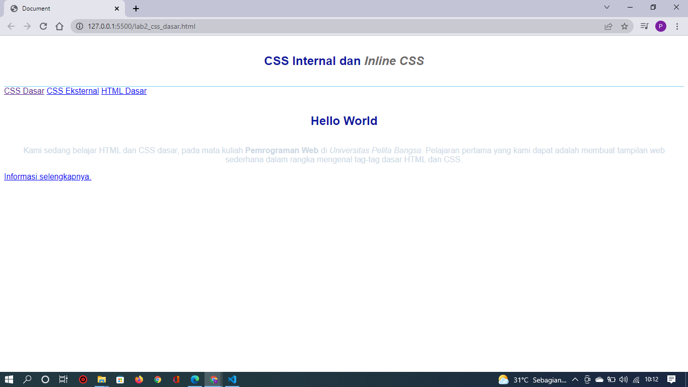

# 4. Membuat CSS Eksternal
 Buatlah file baru dengan nama style_eksternal.css kemudian buatlah deklarasi CSS seperti gambar berikut :
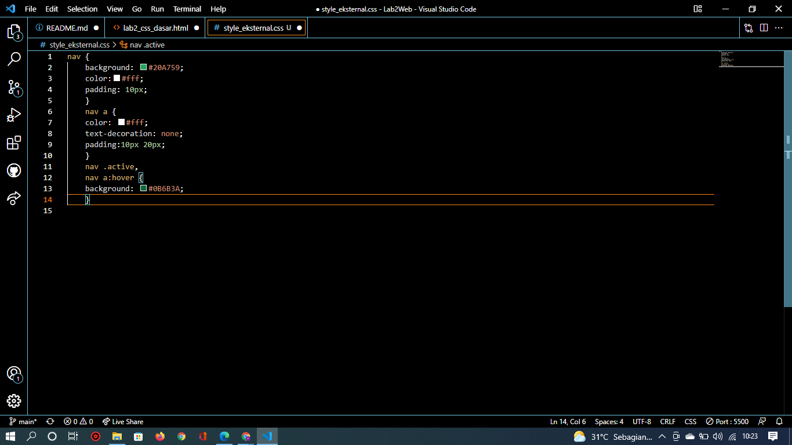
 Kemudian tambahkan tag `<link>` untuk merujuk file css yang sudah dibuat pada bagian `<head>` seperti gambar berikut :
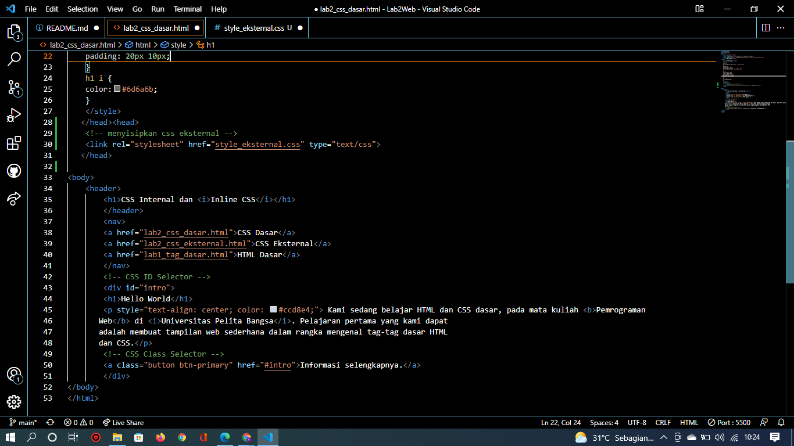
 Selanjutnya refresh kembali browser untuk melihat perubahannya.
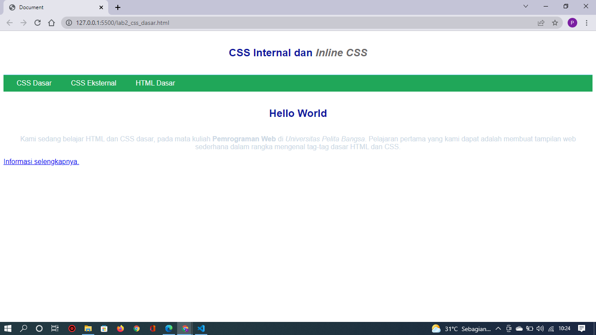

# 5. Menambahkan CSS Selector
 Selanjutnya menambahkan CSS Selector menggunakan ID dan Class Selector. Pada file 
style_eksternal.css, tambahkan kode berikut.
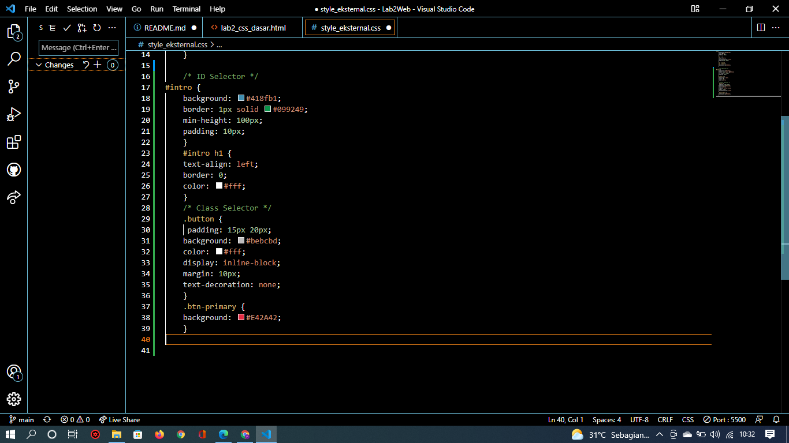
 Kemudian simpan kembali dan refresh browser untuk melihat perubahannya.
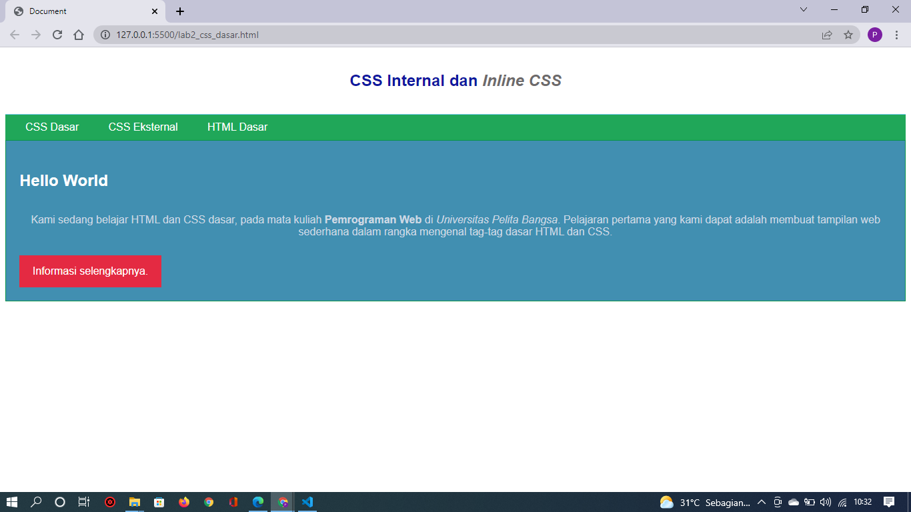

# Pertanyaan dan Tugas
1. Lakukan eksperimen dengan mengubah dan menambah properti dan nilai pada kode CSS 
dengan mengacu pada CSS Cheat Sheet yang diberikan pada file terpisah dari modul ini.
2. Apa perbedaan pendeklarasian CSS elemen h1 {...} dengan #intro h1 {...}? berikan 
penjelasannya!
3. Apabila ada deklarasi CSS secara internal, lalu ditambahkan CSS eksternal dan inline CSS pada 
elemen yang sama. Deklarasi manakah yang akan ditampilkan pada browser? Berikan 
penjelasan dan contohnya!
4. Pada sebuah elemen HTML terdapat ID dan Class, apabila masing-masing selector tersebut 
terdapat deklarasi CSS, maka deklarasi manakah yang akan ditampilkan pada browser? 
Berikan penjelasan dan contohnya! ( 
 )
