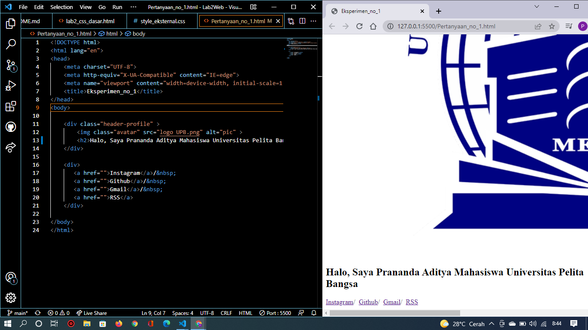
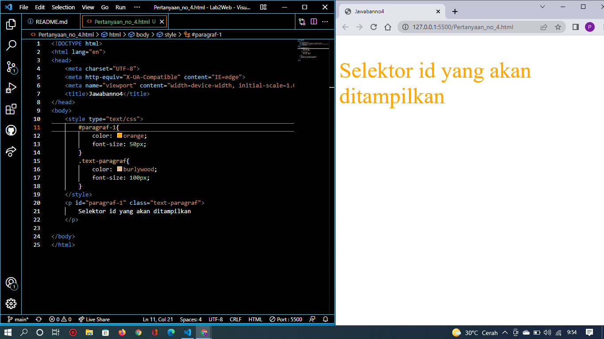

# Lab2Web
## Nama : Prananda Aditya
## NIM  : 312010130
## Kelas : TI.20.A1
## Mata Kuliah : Pemograman Web

# langkah-langkah Praktikum
 yang pertama adalah membuka text editor, saya disini menggunakan text editor VSCode.

# 1. Membuka Dokumen HTML

 Selanjutnya buka browser untuk melihat hasilnya

# 2. Mendeklarasikan CSS Internal
 Kemudian tambahkan deklarasi CSS internal seperti berikut pada bagian head dokumen. Seperti gambar dibawah ini :

 Selanjutnya buka browser kembali untuk melihat hasilnya.

# 3. Menambahkan Inline CSS
 Kemudian tambahkan deklarasi inline CSS pada tag 
 seperti gambar dibawah ini :

 Simpan kembali dan refresh kembali browser untuk melihat perubahannya.

# 4. Membuat CSS Eksternal
 Buatlah file baru dengan nama style_eksternal.css kemudian buatlah deklarasi CSS seperti gambar berikut :

 Kemudian tambahkan tag `<link>` untuk merujuk file css yang sudah dibuat pada bagian `<head>` seperti gambar berikut :

 Selanjutnya refresh kembali browser untuk melihat perubahannya.

# 5. Menambahkan CSS Selector
 Selanjutnya menambahkan CSS Selector menggunakan ID dan Class Selector. Pada file 
style_eksternal.css, tambahkan kode berikut.

 Kemudian simpan kembali dan refresh browser untuk melihat perubahannya.

# Pertanyaan dan Tugas
1. Lakukan eksperimen dengan mengubah dan menambah properti dan nilai pada kode CSS 
dengan mengacu pada CSS Cheat Sheet yang diberikan pada file terpisah dari modul ini.
2. Apa perbedaan pendeklarasian CSS elemen h1 {...} dengan #intro h1 {...}? berikan 
penjelasannya!
3. Apabila ada deklarasi CSS secara internal, lalu ditambahkan CSS eksternal dan inline CSS pada 
elemen yang sama. Deklarasi manakah yang akan ditampilkan pada browser? Berikan 
penjelasan dan contohnya!
4. Pada sebuah elemen HTML terdapat ID dan Class, apabila masing-masing selector tersebut 
terdapat deklarasi CSS, maka deklarasi manakah yang akan ditampilkan pada browser? 
Berikan penjelasan dan contohnya! ( `
` )

# jawaban
  1. Saya akan mengubah dan menambah properti dan nilai pada kode CSS, dimulai dari membuat kerangka html nya. Seperti gambar berikut :

 Kemudian membuat CSS nya dengan menambahkan nilai dan properti pada kode diatas Disini Saya menambahkan 4 selector kedalam CSS, diantaranya body, h2, .avatar, .header-profile. Masing - masing memiliki fungsi untuk mengatur tampilan pada HTML

 Pada selector body saya menambahkan properti, yaitu width, font-size, color, width, DST. Pada selector h2 saya menambahkan properti, yaitu font-width, fonth-size Pada selector .avatar saya menambahkan properti, yaitu width, border-radius Pada selector .header-profile saya menambahkan properti, yaitu justify-content, align-items

 Pada hasil tersebut dapat dilihat, pada mode mobile lebar body terlalu ke tengah, karena widht pada selektor body diatur dengan nilai 50% pada ukuran desktop, agar dapat terlihat proporsional pada ukuran mobile dapat ditambahkan selektor @media only screen and (max-width: 760px), dan hasil nya bisa dilihat.

 2.Perbedaan antara element h1 {...} dengan #intro h1 {...} adalah : h1 {...} Antuk memberikan style pada semua h1 sedangkan, #intro h1 {...} Awalan simbol hash (#) memungkinkan kita untuk memberikan style pada id. selector id bersifat kaku dan tidak bisa digunakan kembali pada element yang lainnya. Menurut saya lebih baik menggunakan selektor class untuk mendefinisikan element yang ingin diberi nilai.

 3.Setelah dilakukan pengujian, deklarasi CSS Inline lebih dahulu tampil di browser, itu dikarenakan permintaan HTTP yang sangat kecil memungkinkan untuk ditampilkan dahulu

 Berikut merupakan hasil pengujian deklarasi CSS

 CSS Inline `blue`

 CSS Internal `red`

 CSS Eksternal `yellow`

 4.Deklarasi `id="paragraf-1"` akan ditampilkan pada browser, karena selektor id lebih spesifik dari class atau bahkan element P itu sendiri, kecuali jika kita menambahkan property pada inline element P maka selektor id tersebut akan tertimpa, karena inline lebih spesifik daripada id, class, dan element
